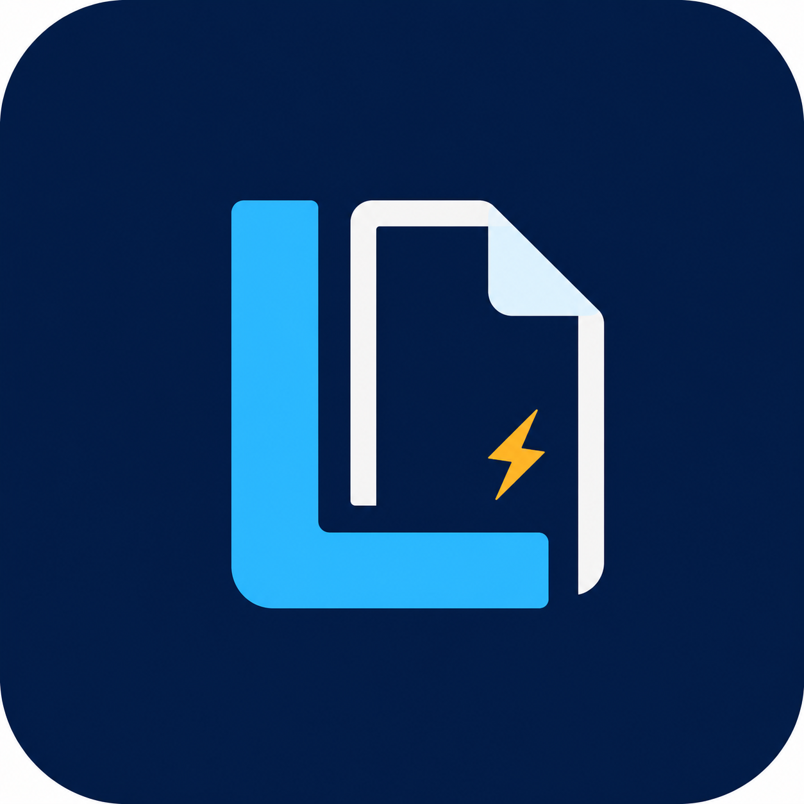

# Leccy

<div align="center">
  
  <h3>The Modern, Offline-First Lecture & Study Organizer</h3>
</div>

Leccy is a beautifully designed lecture and study organizer application built with Flutter. Originally developed as a Windows-first desktop application, it embraces a fluid, glassmorphic UI to provide students, researchers, and lifelong learners with an engaging, distraction-free environment for their studies. 

> **🎉 New Release!** Leccy is now easily installable on Windows via a standalone `.exe` setup installer!

---

## ✨ Features

Leccy is packed with powerful features designed to help you organize, summarize, and study effectively:

### 📚 Ultimate Organization
- **Custom Folders:** Group your files into distinct folders. Customize them with vibrant colors, custom badges, and unique cover images.
- **Intuitive Library:** Search, sort, and display your folders in grid or list views.
- **Offline & Private:** By default, Leccy uses robust local SQLite persistence. All your study materials, notes, and metadata stay safely on your device—no internet connection required.

### 📝 Rich Text Editing & Quick Notes
- **Advanced Editor:** Create comprehensive lecture notes using a powerful rich-text editor (powered by Flutter Quill). Support for inline formatting, headers, and more.
- **Quick Notes & Descriptions:** Add brief synopses or important "quick notes" to any file for fast reference.
- **Fullscreen Mode:** Toggle fullscreen mode for a complete, distraction-free writing and reading experience.

### 🧠 Smart Local Summaries
- **Offline Summarization:** Automatically generate concise plain-text summaries of your long lecture notes. Leccy analyzes your text locally using sentence scoring and extraction—keeping your data entirely private without relying on external AI APIs.

### 📊 Progress Tracking
- **Granular Progress:** Use interactive sliders and markers to track your reading and study progress on individual files.
- **Folder Overviews:** Automatically calculate and display the average progress across all files within a specific folder.

### 🎓 Study Sets & Flashcards
- **Curated Study Sets:** Group important lecture files into dedicated "Study Sets" for targeted exam prep.
- **Flashcard Workspace:** Quickly transform your notes into a flashcard-oriented interface, enabling active recall and efficient review sessions.
- **Marker Tracking:** Save exact study progress markers for individual items within your study sets.

### 📈 Data Visualization Workspaces
- **Built-in Tables & Graphs:** Need to handle data? Switch to the data workspace to manage tables and visualize complex datasets with custom graph painters directly alongside your notes.

### 🎨 Stunning Aesthetics
- **Glassmorphic UI:** Enjoy a premium, modern design featuring subtle glass effects, liquid wallpapers, and responsive animations.
- **Theming:** Customize your experience with different font presets, accent colors, and editor paper backgrounds. A dedicated "Fast Mode" is also available to disable complex visual effects on lower-end hardware.

---

## 🚀 Installation & Setup

### Download for Windows

Go to the [GitHub Releases page](https://github.com/Tawan4722/Leccy/releases) and download one of these files:

- `Leccy-Windows-Setup.exe` - recommended installer with Start Menu and desktop shortcuts.
- `Leccy-Windows-portable.zip` - portable build you can unzip and run directly.

### 📦 Install via Windows Setup (.exe)

If you want to build the installer yourself:

1. Download and install [Inno Setup Compiler](https://jrsoftware.org/isdl.php).
2. Open the `LeccyInstaller.iss` file located in the root of this project.
3. Click **Compile** (or press `Ctrl+F9`).
4. The Inno Setup compiler will generate a fully standalone setup executable (`LeccySetup.exe`) inside the newly created `Output/` folder.
5. Run `LeccySetup.exe` to install the app and create your desktop shortcuts!

### 🛠️ Building from Source

To run or build Leccy manually, you will need the following tools:

- [Flutter SDK](https://flutter.dev/docs/get-started/install) (Dart SDK ^3.11.5)
- Windows Developer Mode enabled
- Visual Studio (with "Desktop development with C++" workload)

**To run the application in development mode:**
```powershell
flutter run -d windows
```
*(Note: Chrome preview is supported via `flutter run -d chrome` for UI testing, but uses volatile in-memory storage. Any data created in Chrome will reset when the browser restarts.)*

**To build a production Windows release binary:**
```powershell
flutter build windows --release
```
The compiled source files will be located at `build/windows/x64/runner/Release/`.

---

## 🤝 Contributing

Pull requests are welcome! If you want to make major changes or introduce new features, please open an issue first to discuss what you would like to change. 

## 📜 License

This project is licensed under the terms described in the `LICENSE` file.
